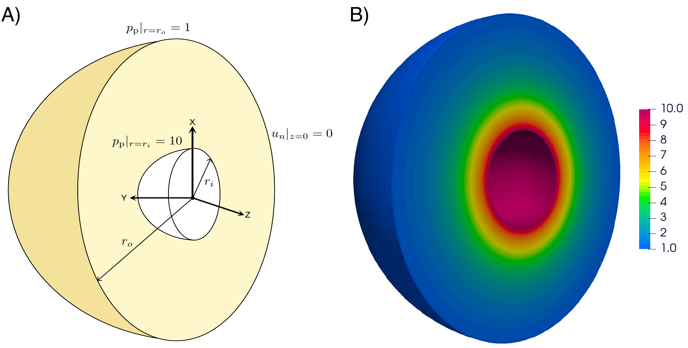
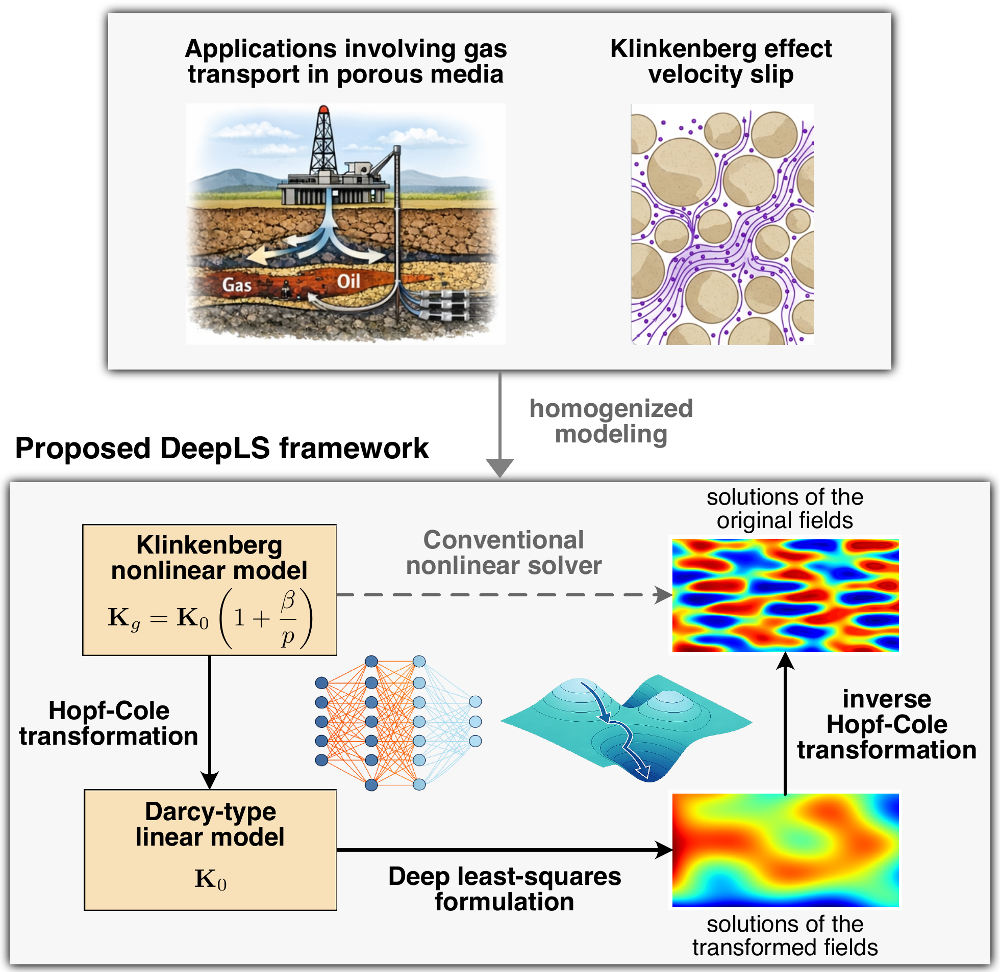
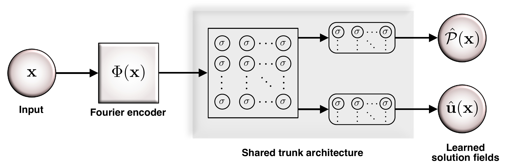

# A Machine Learning–Enhanced Hopf–Cole Formulation for Nonlinear Gas Flow in Porous Media

[](#)
[](#)
[](#)
[](#license)

This repository contains the source code and reproducible numerical examples associated with the paper:

> **A Machine Learning–Enhanced Hopf–Cole Formulation for Nonlinear Gas Flow in Porous Media**  
> Venkat S. Maduri and Kalyana B. Nakshatrala  
> Department of Civil and Environmental Engineering, University of Houston

The paper develops a Deep Least-Squares (DeepLS) framework for nonlinear gas flow in porous media with pressure-dependent apparent permeability induced by the Klinkenberg effect. The key idea is to use a Hopf–Cole transformation to recast the nonlinear Klinkenberg model into a linear Darcy-type mixed system, and then solve the transformed problem using a shared-trunk neural network that predicts both pressure and Darcy velocity.

---

## Graphical abstract

<p align="center">
  
</p>

<p align="center">
  <b>Graphical abstract.</b> Three-dimensional concentric spherical gas-flow problem and representative pressure prediction obtained using the proposed DeepLS framework.
</p>

---

## Highlights

- **Klinkenberg gas-flow model:** captures pressure-dependent apparent permeability in low-pressure and tight porous media.
- **Hopf–Cole transformation:** maps the nonlinear pressure-dependent problem into a linear Darcy-type problem in a transformed pressure variable.
- **Mixed pressure–velocity formulation:** predicts pressure and Darcy velocity simultaneously rather than recovering velocity by post-processing.
- **Shared-trunk neural architecture:** uses a common latent representation with separate output heads for transformed pressure and velocity.
- **Deep Least-Squares solver:** minimizes residuals of the transformed governing equations and boundary conditions.
- **Verification suite:** includes concentric-cylinder, footing, layered-media, and concentric-sphere benchmark problems.
- **Mechanics-based verification:** includes a Betti-type reciprocity residual as an a posteriori consistency indicator.

---

## Framework overview

<p align="center">
  
</p>

<p align="center">
  <b>Figure 1.</b> Conceptual workflow of the proposed DeepLS framework. The nonlinear Klinkenberg model is transformed into a Darcy-type linear model through the Hopf–Cole transformation. The transformed pressure and velocity fields are learned using a least-squares neural formulation, and the physical pressure is recovered by the inverse Hopf–Cole transformation.
</p>


---

## Model summary

The apparent gas permeability is modeled as pressure dependent:

```math
\mathbf{K}_g(\mathbf{x},p)
=
\mathbf{K}_0(\mathbf{x})
\left(
1+\frac{\beta p_{\mathrm{atm}}}{p(\mathbf{x})}
\right)
```

where `K0` is the intrinsic permeability tensor, `p` is the absolute gas pressure, `beta` is the dimensionless Klinkenberg parameter, and `p_atm` is atmospheric pressure.

The Hopf–Cole transformed pressure is defined as

```math
P(\mathbf{x})
=
p(\mathbf{x})
+
\beta p_{\mathrm{atm}}
\ln\!\left[p(\mathbf{x})\right]
```

which gives the transformed mixed Darcy-type system

```math
\mu \mathbf{K}_0^{-1}(\mathbf{x})\mathbf{u}(\mathbf{x})
+
\mathrm{grad}\!\left[P(\mathbf{x})\right]
=
\mathbf{0}
\qquad
\mathrm{in}\ \Omega
```

```math
\mathrm{div}\!\left[\mathbf{u}(\mathbf{x})\right]
=
0
\qquad
\mathrm{in}\ \Omega
```

with boundary conditions

```math
\mathbf{u}(\mathbf{x})\bullet \widehat{\mathbf{n}}(\mathbf{x})
=
u_n(\mathbf{x})
\qquad
\mathrm{on}\ \Gamma_u
```

```math
P(\mathbf{x})
=
P_p(\mathbf{x})
\qquad
\mathrm{on}\ \Gamma_p
```

where

```math
P_p(\mathbf{x})
=
p_p(\mathbf{x})
+
\beta p_{\mathrm{atm}}
\ln\!\left[p_p(\mathbf{x})\right]
```

After solving for `P`, the physical gas pressure is recovered using the principal branch of the Lambert–W function:

```math
p(\mathbf{x})
=
\beta p_{\mathrm{atm}}
W_0
\left(
\frac{1}{\beta p_{\mathrm{atm}}}
\exp\!\left[
\frac{P(\mathbf{x})}{\beta p_{\mathrm{atm}}}
\right]
\right)
```

---

## Deep Least-Squares formulation

The residuals of the transformed problem are

```math
\mathbf{R}_1
:=
\mu \mathbf{K}_0^{-1}(\mathbf{x})\mathbf{u}(\mathbf{x})
+
\mathrm{grad}\!\left[P(\mathbf{x})\right]
```

```math
R_2
:=
\mathrm{div}\!\left[\mathbf{u}(\mathbf{x})\right]
```

```math
R_3
:=
\mathbf{u}(\mathbf{x})\bullet \widehat{\mathbf{n}}(\mathbf{x})
-
u_n(\mathbf{x})
```

```math
R_4
:=
P(\mathbf{x})-P_p(\mathbf{x})
```

The least-squares functional minimized by the DeepLS solver is

```math
\Pi_{\mathrm{LS}}[P,\mathbf{u}]
=
\frac{1}{2}
\left\|
\mu^{-1/2}\sqrt{\mathbf{K}_0(\mathbf{x})}\,\mathbf{R}_1
\right\|_{\Omega}^{2}
+
\frac{1}{2}
\left\|
R_2
\right\|_{\Omega}^{2}
+
\frac{1}{2}
\left\|
R_3
\right\|_{\Gamma_u}^{2}
+
\frac{1}{2}
\left\|
R_4
\right\|_{\Gamma_p}^{2}
```

---

## Neural architecture

The DeepLS model uses a Fourier-feature input encoder, a shared trunk, and two output heads: one for the transformed pressure and one for the Darcy velocity.

<p align="center">
  
</p>

<p align="center">
  <b>Figure 2.</b> Shared-trunk neural-network architecture used in the DeepLS formulation. The input coordinates are lifted through a Fourier-feature encoder, followed by a shared trunk and task-specific output heads for the transformed pressure and Darcy velocity.
</p>


---

## Installation

Clone the repository:

```bash
git clone https://github.com/CAMLKBN/DeepLSCodes.git
cd DeepLSCodes
```

Create and activate a virtual environment:

```bash
python -m venv .venv
source .venv/bin/activate
```

Install dependencies:

```bash
pip install -r requirements.txt
```

A typical `requirements.txt` may include:

```text
numpy
scipy
matplotlib
torch
tqdm
```

---

## Quick start

Run one of the benchmark examples:

```bash
python examples/concentric_cylinders/main.py
```

Generate plots after training:

```bash
python examples/concentric_cylinders/plot_results.py
```

The exact script names may differ depending on the final code organization.


## Citation

Please cite the paper if you use this repository in your work.

```bibtex
@article{maduri2026hopfcole,
  title   = {A Machine Learning-Enhanced Hopf--Cole Formulation for Nonlinear Gas Flow in Porous Media},
  author  = {Maduri, Venkat S. and Nakshatrala, Kalyana B.},
  journal = {Computer Methods in Applied Mechanics and Engineering},
  volume  = {435},
  pages   = {119185},
  year    = {2026},
  issn    = {0045-7825},
  doi     = {10.1016/j.cma.2026.119185},
  publisher = {Elsevier}
}
```

---

## License

The license has not yet been specified. Add a `LICENSE` file before public release.

---

## Acknowledgments

This work acknowledges support from the Environmental Molecular Sciences Laboratory (EMSL), a DOE Office of Science User Facility sponsored by the Biological and Environmental Research program.
