# A Machine Learning–Enhanced Hopf–Cole Formulation for Nonlinear Gas Flow in Porous Media

[](#)
[](#)
[](#)
[](#license)

This repository contains the source code and reproducible numerical examples associated with the paper:

> **A Machine Learning–Enhanced Hopf–Cole Formulation for Nonlinear Gas Flow in Porous Media**  
> Venkat S. Maduri and Kalyana B. Nakshatrala  
> Department of Civil and Environmental Engineering, University of Houston

The paper develops a Deep Least-Squares (DeepLS) framework for nonlinear gas flow in porous media with pressure-dependent apparent permeability induced by the Klinkenberg effect. The key idea is to use a Hopf–Cole transformation to recast the nonlinear Klinkenberg model into a linear Darcy-type mixed system, and then solve the transformed problem using a shared-trunk neural network that predicts both pressure and Darcy velocity.

---

## Graphical abstract

<p align="center">
  
</p>

<p align="center">
  <b>Graphical abstract.</b> Three-dimensional concentric spherical gas-flow problem and representative pressure prediction obtained using the proposed DeepLS framework.
</p>

---

## Highlights

- **Klinkenberg gas-flow model:** captures pressure-dependent apparent permeability in low-pressure and tight porous media.
- **Hopf–Cole transformation:** maps the nonlinear pressure-dependent problem into a linear Darcy-type problem in a transformed pressure variable.
- **Mixed pressure–velocity formulation:** predicts pressure and Darcy velocity simultaneously rather than recovering velocity by post-processing.
- **Shared-trunk neural architecture:** uses a common latent representation with separate output heads for transformed pressure and velocity.
- **Deep Least-Squares solver:** minimizes residuals of the transformed governing equations and boundary conditions.
- **Verification suite:** includes concentric-cylinder, footing, layered-media, and concentric-sphere benchmark problems.
- **Mechanics-based verification:** includes a Betti-type reciprocity residual as an a posteriori consistency indicator.

---

## Framework overview

<p align="center">
  
</p>

<p align="center">
  <b>Figure 1.</b> Conceptual workflow of the proposed DeepLS framework. The nonlinear Klinkenberg model is transformed into a Darcy-type linear model through the Hopf–Cole transformation. The transformed pressure and velocity fields are learned using a least-squares neural formulation, and the physical pressure is recovered by the inverse Hopf–Cole transformation.
</p>


---

## Model summary

The apparent gas permeability is modeled as pressure dependent:

```math
\mathbf{K}_g(\mathbf{x},p)
=
\mathbf{K}_0(\mathbf{x})
\left(
1+\frac{\beta p_{\mathrm{atm}}}{p(\mathbf{x})}
\right)
```

where `K0` is the intrinsic permeability tensor, `p` is the absolute gas pressure, `beta` is the dimensionless Klinkenberg parameter, and `p_atm` is atmospheric pressure.

The Hopf–Cole transformed pressure is defined as

```math
P(\mathbf{x})
=
p(\mathbf{x})
+
\beta p_{\mathrm{atm}}
\ln\!\left[p(\mathbf{x})\right]
```

which gives the transformed mixed Darcy-type system

```math
\mu \mathbf{K}_0^{-1}(\mathbf{x})\mathbf{u}(\mathbf{x})
+
\mathrm{grad}\!\left[P(\mathbf{x})\right]
=
\mathbf{0}
\qquad
\mathrm{in}\ \Omega
```

```math
\mathrm{div}\!\left[\mathbf{u}(\mathbf{x})\right]
=
0
\qquad
\mathrm{in}\ \Omega
```

with boundary conditions

```math
\mathbf{u}(\mathbf{x})\bullet \widehat{\mathbf{n}}(\mathbf{x})
=
u_n(\mathbf{x})
\qquad
\mathrm{on}\ \Gamma_u
```

```math
P(\mathbf{x})
=
P_p(\mathbf{x})
\qquad
\mathrm{on}\ \Gamma_p
```

where

```math
P_p(\mathbf{x})
=
p_p(\mathbf{x})
+
\beta p_{\mathrm{atm}}
\ln\!\left[p_p(\mathbf{x})\right]
```

After solving for `P`, the physical gas pressure is recovered using the principal branch of the Lambert–W function:

```math
p(\mathbf{x})
=
\beta p_{\mathrm{atm}}
W_0
\left(
\frac{1}{\beta p_{\mathrm{atm}}}
\exp\!\left[
\frac{P(\mathbf{x})}{\beta p_{\mathrm{atm}}}
\right]
\right)
```

---

## Deep Least-Squares formulation

The residuals of the transformed problem are

```math
\mathbf{R}_1
:=
\mu \mathbf{K}_0^{-1}(\mathbf{x})\mathbf{u}(\mathbf{x})
+
\mathrm{grad}\!\left[P(\mathbf{x})\right]
```

```math
R_2
:=
\mathrm{div}\!\left[\mathbf{u}(\mathbf{x})\right]
```

```math
R_3
:=
\mathbf{u}(\mathbf{x})\bullet \widehat{\mathbf{n}}(\mathbf{x})
-
u_n(\mathbf{x})
```

```math
R_4
:=
P(\mathbf{x})-P_p(\mathbf{x})
```

The least-squares functional minimized by the DeepLS solver is

```math
\Pi_{\mathrm{LS}}[P,\mathbf{u}]
=
\frac{1}{2}
\left\|
\mu^{-1/2}\sqrt{\mathbf{K}_0(\mathbf{x})}\,\mathbf{R}_1
\right\|_{\Omega}^{2}
+
\frac{1}{2}
\left\|
R_2
\right\|_{\Omega}^{2}
+
\frac{1}{2}
\left\|
R_3
\right\|_{\Gamma_u}^{2}
+
\frac{1}{2}
\left\|
R_4
\right\|_{\Gamma_p}^{2}
```

---

## Neural architecture

The DeepLS model uses a Fourier-feature input encoder, a shared trunk, and two output heads: one for the transformed pressure and one for the Darcy velocity.

<p align="center">
  
</p>

<p align="center">
  <b>Figure 2.</b> Shared-trunk neural-network architecture used in the DeepLS formulation. The input coordinates are lifted through a Fourier-feature encoder, followed by a shared trunk and task-specific output heads for the transformed pressure and Darcy velocity.
</p>

<p align="center">
  <a href="assets/Fig_2_NN_Architecture.pdf">High-resolution PDF</a>
</p>

---

## Installation

Clone the repository:

```bash
git clone https://github.com/CAMLKBN/DeepLSCodes.git
cd DeepLSCodes
```

Create and activate a virtual environment:

```bash
python -m venv .venv
source .venv/bin/activate
```

Install dependencies:

```bash
pip install -r requirements.txt
```

A typical `requirements.txt` may include:

```text
numpy
scipy
matplotlib
torch
tqdm
```

---

## Quick start

Run one of the benchmark examples:

```bash
python examples/concentric_cylinders/main.py
```

Generate plots after training:

```bash
python examples/concentric_cylinders/plot_results.py
```

The exact script names may differ depending on the final code organization.

---

## Numerical examples

### 1. Gas flow through concentric cylinders

This benchmark compares the DeepLS prediction against the analytical Klinkenberg solution and the classical Darcy response. The pressure and velocity fields exhibit radial structure, and the DeepLS solution agrees closely with the analytical transformed solution.

<p align="center">
  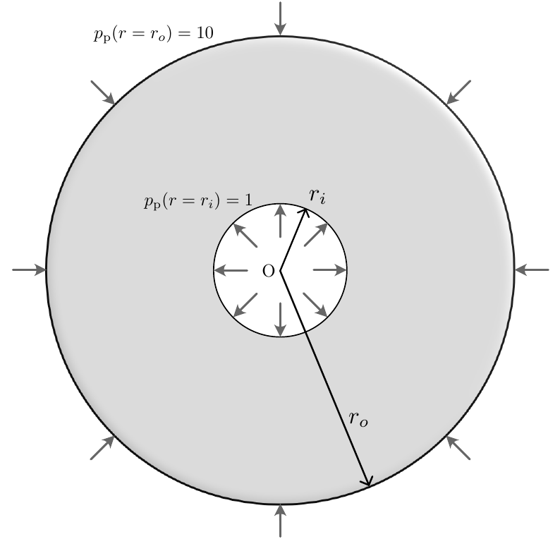
</p>

<p align="center">
  <b>Figure 3.</b> Concentric-cylinder benchmark problem. Prescribed pressures are imposed on the inner and outer circular boundaries, producing an axisymmetric radial flow field.
</p>

<p align="center">
  <a href="assets/Fig_3_Kinkenberg_2D_Candle_filter_problem.pdf">High-resolution PDF</a>
</p>

<p align="center">
  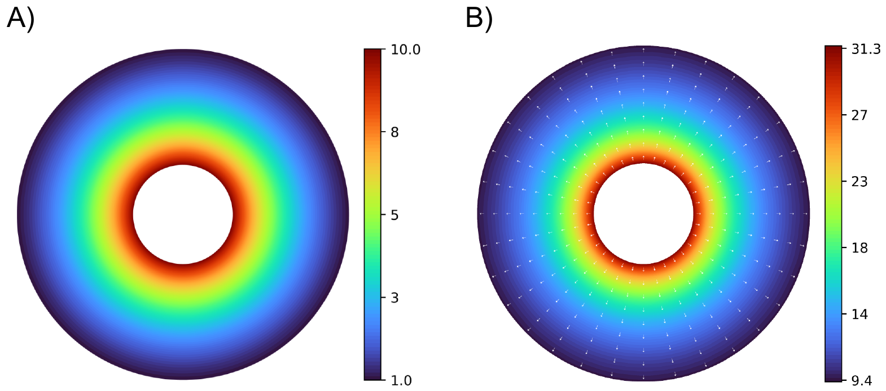
</p>

<p align="center">
  <b>Figure 4.</b> DeepLS prediction for the concentric-cylinder problem: pressure field and velocity-magnitude field with velocity vectors.
</p>

<p align="center">
  <a href="assets/Fig_4_Klinkenberg_Solution_Concentric_Circles.pdf">High-resolution PDF</a>
</p>

<p align="center">
  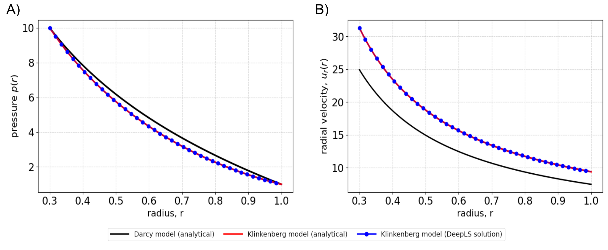
</p>

<p align="center">
  <b>Figure 5.</b> Comparison between analytical solutions and DeepLS predictions for the radial pressure and radial velocity profiles. The Klinkenberg correction produces a clear deviation from the classical Darcy response.
</p>

<p align="center">
  <a href="assets/Fig_5_Analytical_Solution_VS_Numerical_Solution.pdf">High-resolution PDF</a>
</p>

<p align="center">
  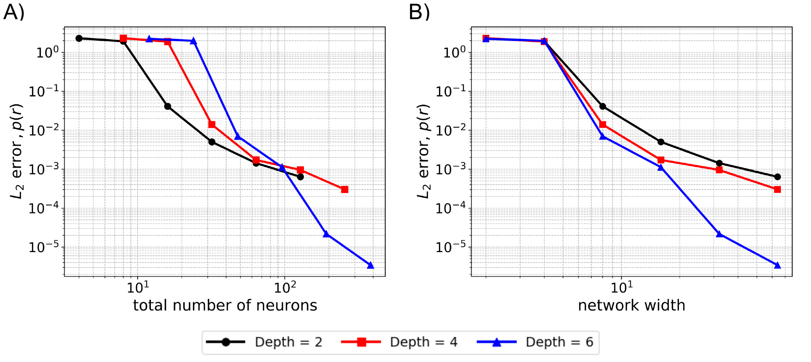
</p>

<p align="center">
  <b>Figure 6.</b> Convergence of the DeepLS approximation with increasing network capacity. The error decreases as network width and depth are increased.
</p>

<p align="center">
  <a href="assets/Fig_6_L2_error.pdf">High-resolution PDF</a>
</p>

---

### 2. Footing problem

The footing benchmark introduces mixed pressure and no-flux boundary segments. The DeepLS result is compared with a stabilized mixed finite element reference solution, and the relative errors decrease as the collocation density increases.

<p align="center">
  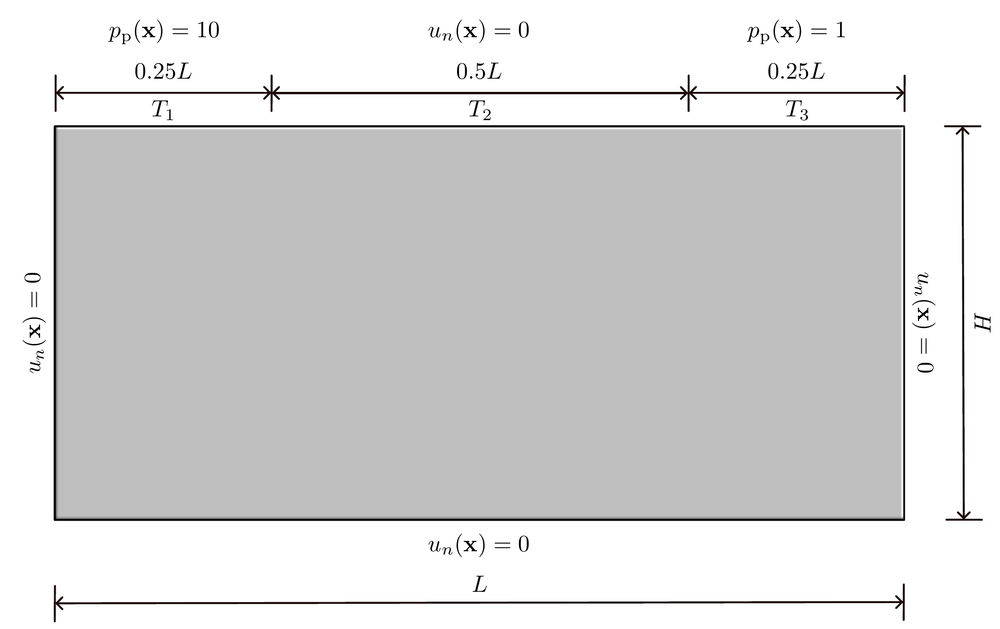
</p>

<p align="center">
  <b>Figure 7.</b> Footing-type boundary-value problem with mixed pressure and no-flux boundary segments. This benchmark tests the ability of the method to handle abrupt transitions between different boundary conditions.
</p>

<p align="center">
  <a href="assets/Fig_7_Footing_BVP.pdf">High-resolution PDF</a>
</p>

<p align="center">
  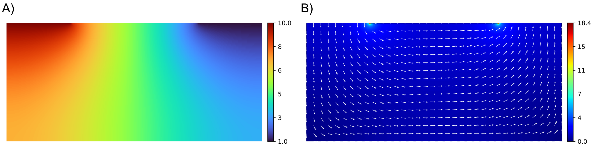
</p>

<p align="center">
  <b>Figure 8.</b> DeepLS prediction for the footing problem: pressure field and velocity-magnitude field.
</p>

<p align="center">
  <a href="assets/Fig_8_DLS_Footing_Solution.pdf">High-resolution PDF</a>
</p>

<p align="center">
  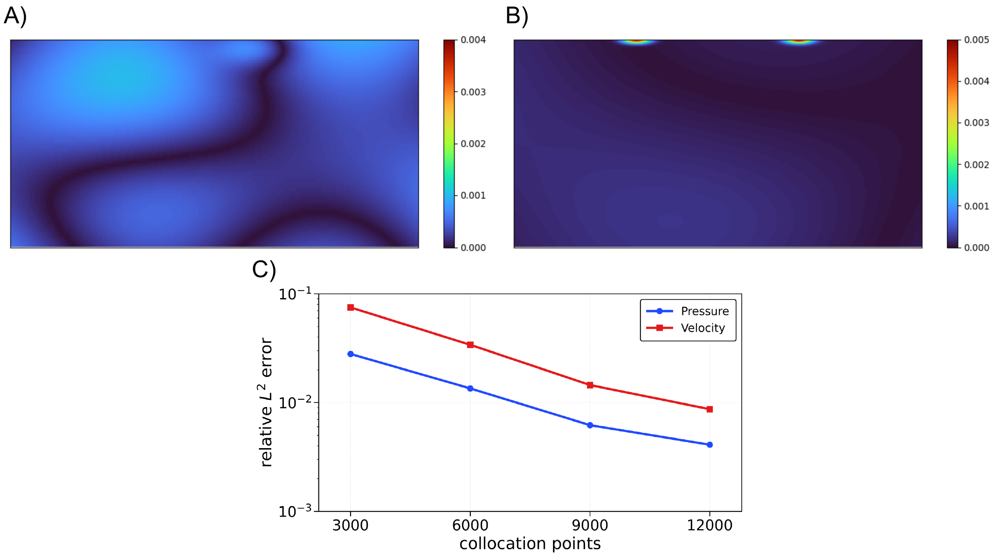
</p>

<p align="center">
  <b>Figure 9.</b> Footing problem error analysis. The figure shows pressure and velocity-magnitude errors relative to a stabilized mixed finite element reference solution, together with relative error convergence as the collocation density increases.
</p>

<p align="center">
  <a href="assets/Fig_9_DLS_Footing_Absolute_error.pdf">High-resolution PDF</a>
</p>

<p align="center">
  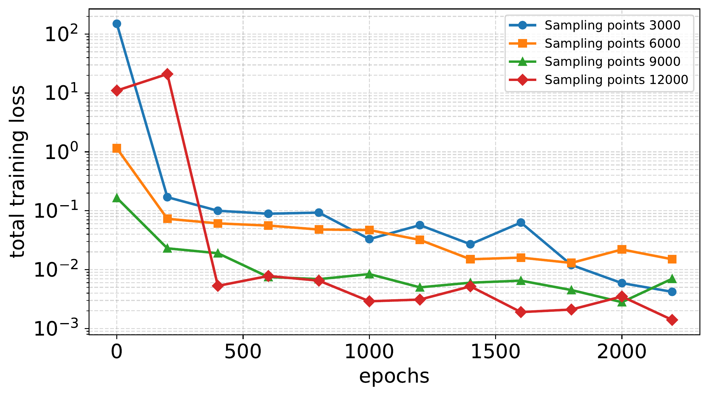
</p>

<p align="center">
  <b>Figure 10.</b> Total training loss for different collocation densities. Increasing the number of collocation points improves residual enforcement and lowers the terminal loss.
</p>

<p align="center">
  <a href="assets/Fig_10_Total_Loss_vs_Epochs.pdf">High-resolution PDF</a>
</p>

---

### 3. Flow through a layered porous medium

The layered-medium benchmark tests interface-resolving behavior under discontinuous intrinsic permeability. The predicted pressure remains continuous, while the velocity field reflects the layer-wise permeability contrast.

<p align="center">
  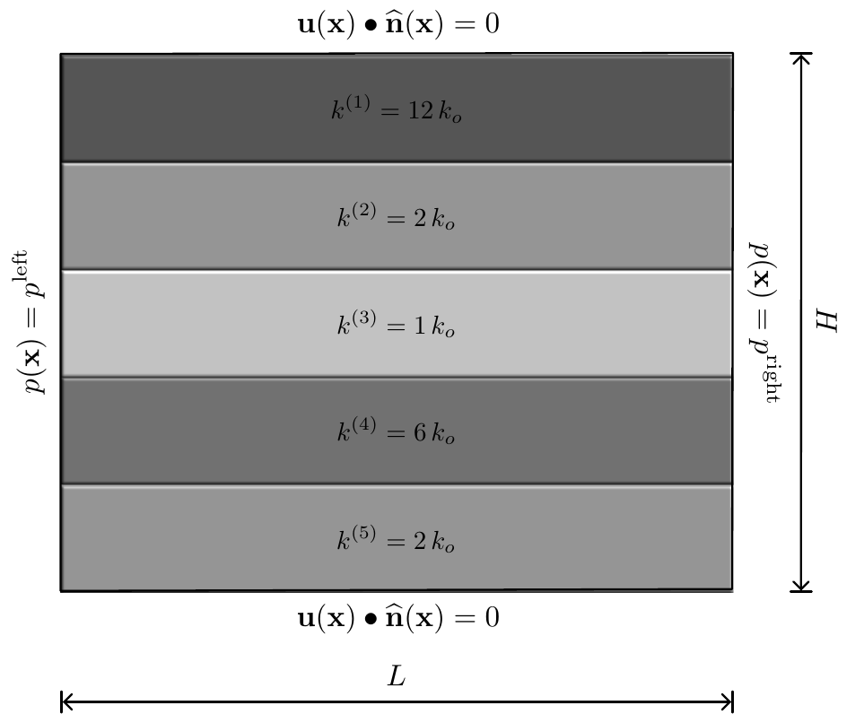
</p>

<p align="center">
  <b>Figure 11.</b> Layered porous medium benchmark with piecewise-constant intrinsic permeability. The problem tests the ability of the formulation to resolve sharp material interfaces and layer-wise flow redistribution.
</p>

<p align="center">
  <a href="assets/Fig_11_Layered_Media.pdf">High-resolution PDF</a>
</p>

<p align="center">
  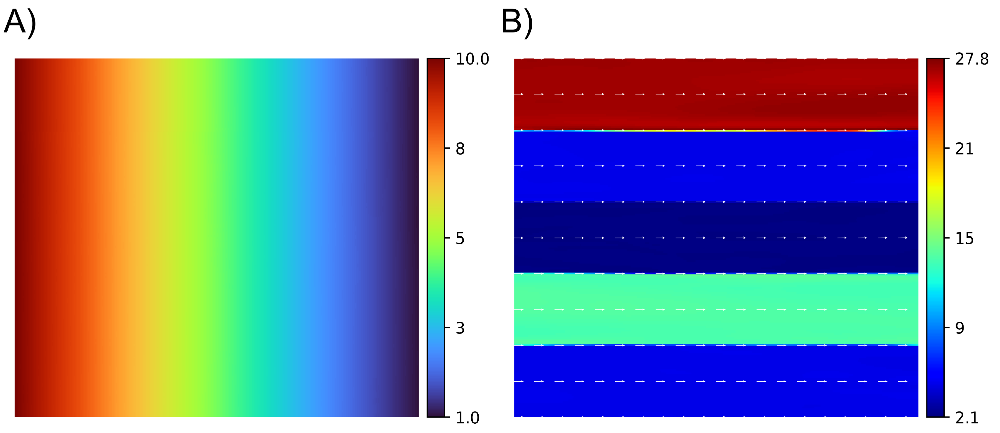
</p>

<p align="center">
  <b>Figure 12.</b> DeepLS prediction for the layered medium: continuous pressure field and layer-dependent velocity magnitude.
</p>

<p align="center">
  <a href="assets/Fig_12_Kinkenberg_Layered_Media_Results.pdf">High-resolution PDF</a>
</p>

<p align="center">
  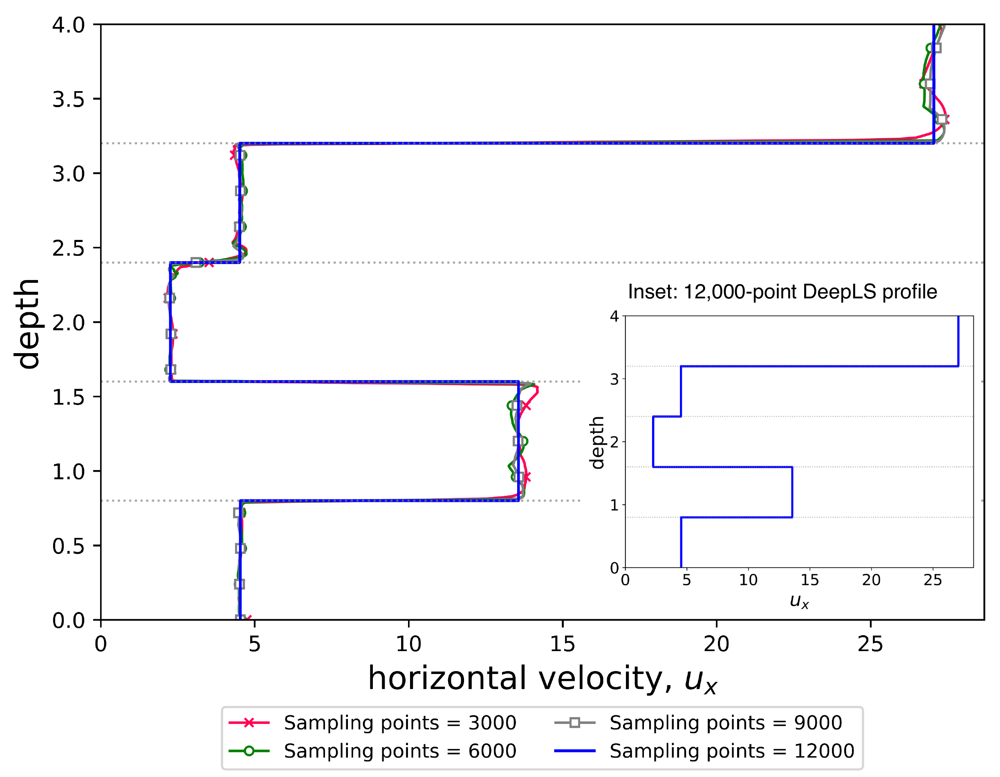
</p>

<p align="center">
  <b>Figure 13.</b> Depthwise horizontal velocity profile in the layered medium. The step-like structure reflects the prescribed permeability stratification and demonstrates interface-resolving behavior.
</p>

<p align="center">
  <a href="assets/Fig_13_Klinkenberg_Layered_Media_Velocity.pdf">High-resolution PDF</a>
</p>

---

### 4. Gas flow through concentric spheres

The three-dimensional spherical-shell benchmark verifies performance on a curved geometry with mixed boundary conditions. The DeepLS predictions recover the analytical radial pressure and velocity profiles.

<p align="center">
  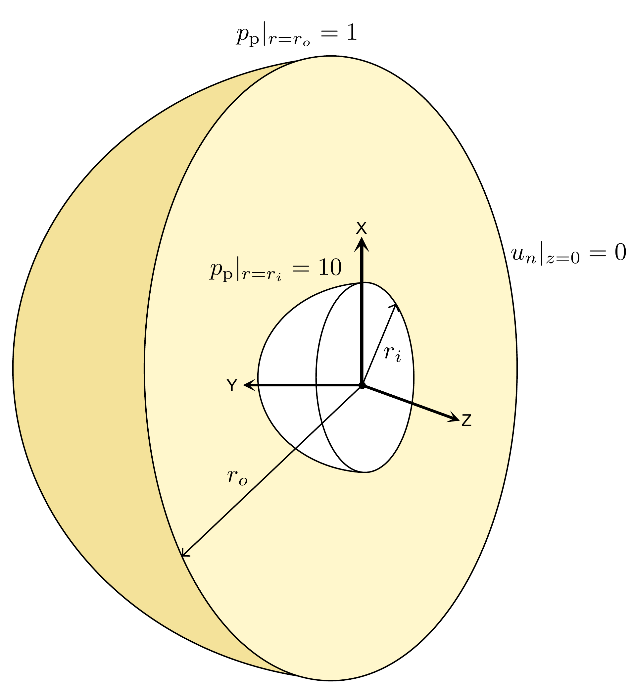
</p>

<p align="center">
  <b>Figure 14.</b> Three-dimensional concentric-sphere benchmark. Prescribed pressure conditions are imposed on the inner and outer spherical boundaries, with a no-normal-flux condition on the symmetry plane.
</p>


<p align="center">
  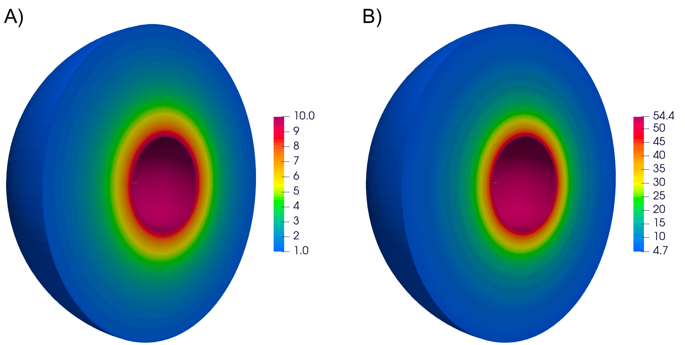
</p>

<p align="center">
  <b>Figure 15.</b> DeepLS prediction for the concentric-sphere problem: pressure field and velocity-magnitude field.
</p>


<p align="center">
  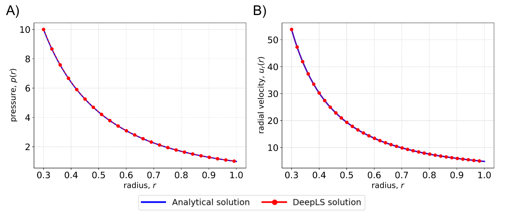
</p>

<p align="center">
  <b>Figure 16.</b> Analytical solution versus DeepLS prediction for the radial pressure and radial velocity profiles in the spherical benchmark.
</p>


<p align="center">
  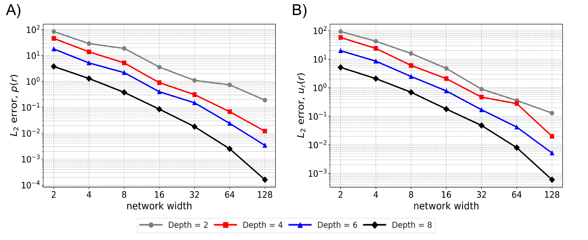
</p>

<p align="center">
  <b>Figure 17.</b> Network-capacity study for the three-dimensional Klinkenberg benchmark. Errors decrease with increasing network width and depth.
</p>

---

## Mechanics-based verification

The repository also includes a Betti-type reciprocity check for the Klinkenberg model. The normalized reciprocity error provides a mechanics-based a posteriori indicator for solution consistency.

For two solution states, the normalized Betti reciprocity error is defined as

```math
\eta_B
:=
\frac{|I_{12}-I_{21}|}{|I_{12}|+|I_{21}|}
```

where

```math
I_{12}
:=
\int_{\Gamma_p}
\left(
p_p^{(2)}(\mathbf{x})
+
\beta p_{\mathrm{atm}}
\ln\!\left[p_p^{(2)}(\mathbf{x})\right]
\right)
\mathbf{u}^{(1)}(\mathbf{x})\bullet \widehat{\mathbf{n}}(\mathbf{x})
\,\mathrm{d}\Gamma
```

and

```math
I_{21}
:=
\int_{\Gamma_p}
\left(
p_p^{(1)}(\mathbf{x})
+
\beta p_{\mathrm{atm}}
\ln\!\left[p_p^{(1)}(\mathbf{x})\right]
\right)
\mathbf{u}^{(2)}(\mathbf{x})\bullet \widehat{\mathbf{n}}(\mathbf{x})
\,\mathrm{d}\Gamma
```

<p align="center">
  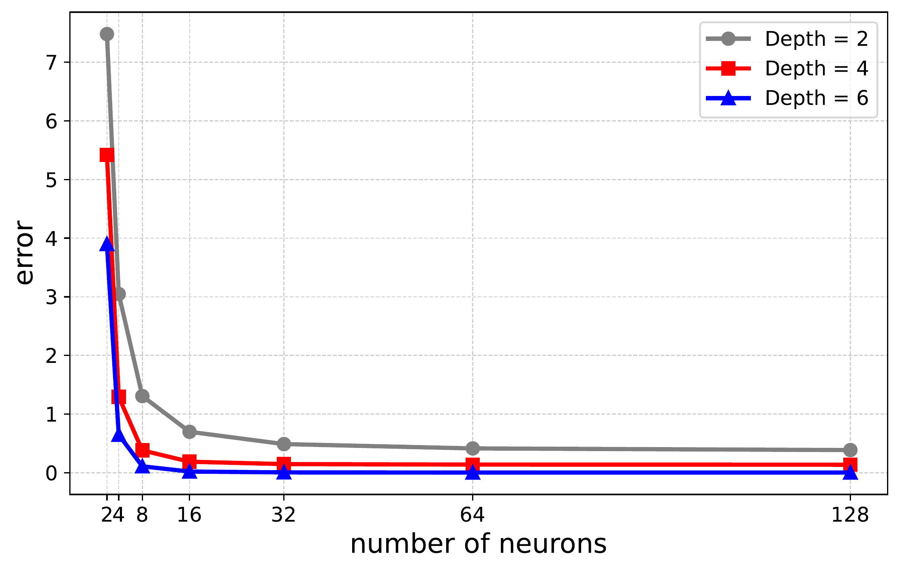
</p>

<p align="center">
  <b>Figure 18.</b> Normalized Betti reciprocity error as a function of the number of neurons per hidden layer. Wider and deeper architectures reduce the reciprocity violation, providing a mechanics-based a posteriori verification measure.
</p>

---

## Appendix: Lambert–W function

The inverse Hopf–Cole map uses the principal real branch of the Lambert–W function. The Lambert–W function satisfies

```math
W(x)e^{W(x)}=x
```

For the positive-pressure regime considered in this work, the argument of the inverse map is positive, and the principal branch `W0` is used.

<p align="center">
  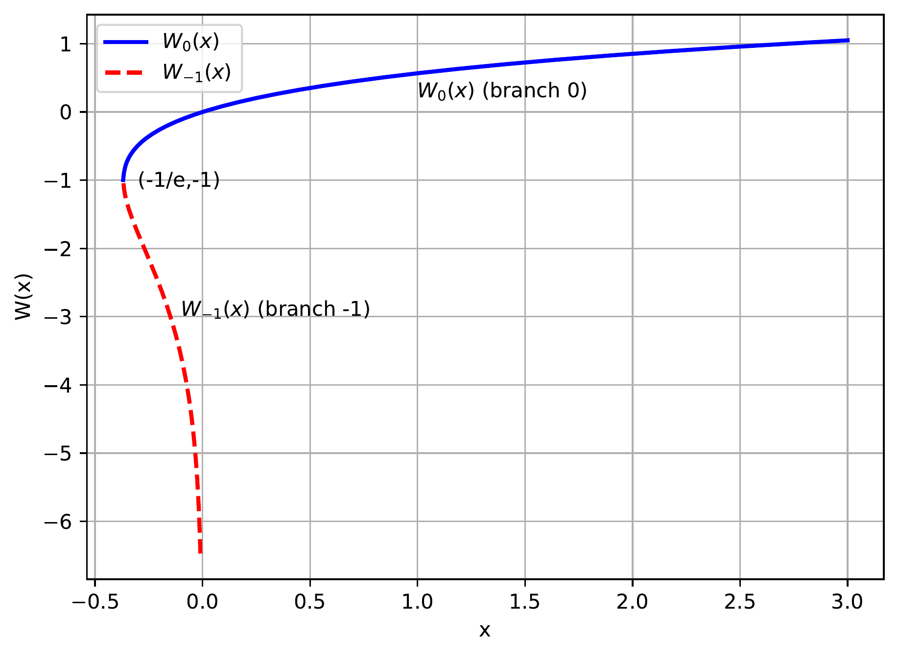
</p>

<p align="center">
  <b>Appendix figure.</b> Real-valued branches of the Lambert–W function. The principal branch is used in the inverse Hopf–Cole transformation for positive-pressure gas-flow states.
</p>

---

## Data and reproducibility

All data used in the numerical examples are synthetic and can be regenerated from the scripts in this repository. Generated figures should be reproducible from the benchmark scripts and plotting utilities.

---

## Citation

Please cite the paper if you use this repository in your work.

```bibtex
@article{maduri2026klinkenbergdeepls,
  title   = {A Machine Learning--Enhanced Hopf--Cole Formulation for Nonlinear Gas Flow in Porous Media},
  author  = {Maduri, Venkat S. and Nakshatrala, Kalyana B.},
  year    = {2026},
  note    = {Preprint}
}
```

---

## License

The license has not yet been specified. Add a `LICENSE` file before public release.

---

## Acknowledgments

This work acknowledges support from the Environmental Molecular Sciences Laboratory (EMSL), a DOE Office of Science User Facility sponsored by the Biological and Environmental Research program.
